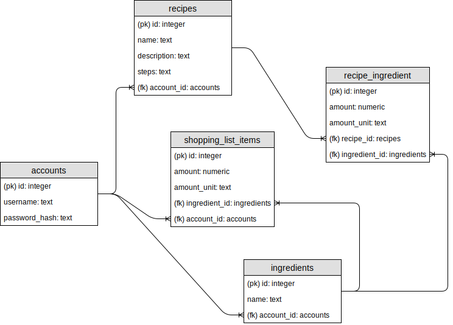

# Recipe book
This is a project for the course "Aineopintojen harjoitustyö:
tietokantasovellus" at the University of Helsinki. The project is a web app for
managing food recipes. The app also features a shopping list for ingredients.

The database diagram for the project
